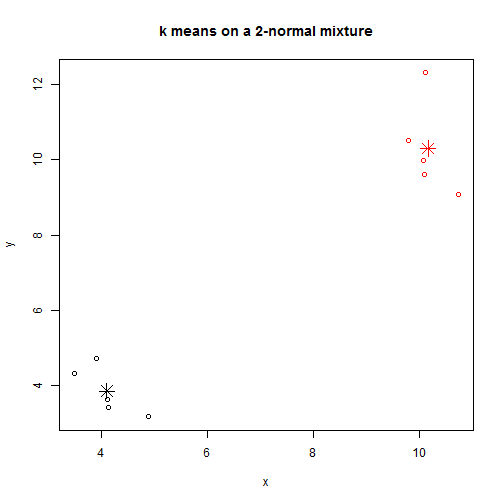
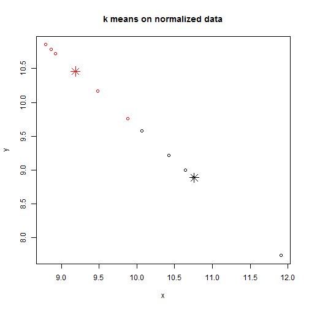
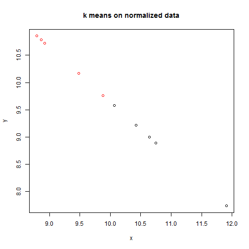

K means on normalized vs. non-normalized data:
================================================

First, a simple contrived example from 2-gaussian mixture:

```r
# make reproducible
set.seed(100)
# create mixture:
x <- rbind(matrix(rnorm(10, mean = 4, sd = 1), ncol = 2), matrix(rnorm(10, mean = 10, 
    sd = 1), ncol = 2))
colnames(x) <- c("x", "y")
cl <- kmeans(x, 2)
plot(x, col = cl$cluster, main = "k means on a 2-normal mixture")
points(cl$centers, col = 1:2, pch = 8, cex = 2)
```

 


Now, we normalize the same data and view quite different results:

```r
# A normalize function:
normalize <- function(x) {
    return(apply(t(apply(t(x), 2, FUN = function(x) {
        x/sum(x)
    })), 2, FUN = function(x) {
        x/sd(x)
    }))
}

# And now k means on normalized data:
cl2 <- kmeans(normalize(x), 2)
plot(normalize(x), col = cl2$cluster, main = "k means on normalized data")
points(cl2$centers, col = 1:2, pch = 8, cex = 2)
```

 


Why does this happen? Observe what happens to x when we normalize:


```r
# original data:
x
```

```
           x      y
 [1,]  3.498  4.319
 [2,]  4.132  3.418
 [3,]  3.921  4.715
 [4,]  4.887  3.175
 [5,]  4.117  3.640
 [6,] 10.090  9.971
 [7,] 10.096  9.611
 [8,]  9.798 10.511
 [9,] 10.740  9.086
[10,] 10.123 12.310
```

```r
# deviding by row sum (document frequency):
t(apply(t(x), 2, FUN = function(x) {
    x/sum(x)
}))
```

```
           x      y
 [1,] 0.4475 0.5525
 [2,] 0.5472 0.4528
 [3,] 0.4541 0.5459
 [4,] 0.6062 0.3938
 [5,] 0.5307 0.4693
 [6,] 0.5030 0.4970
 [7,] 0.5123 0.4877
 [8,] 0.4825 0.5175
 [9,] 0.5417 0.4583
[10,] 0.4513 0.5487
```

```r
# and now devide by std of column (standardize term variance):
normalize(x)
```

```
           x      y
 [1,]  8.791 10.854
 [2,] 10.751  8.895
 [3,]  8.920 10.725
 [4,] 11.909  7.737
 [5,] 10.427  9.219
 [6,]  9.881  9.765
 [7,] 10.065  9.581
 [8,]  9.478 10.168
 [9,] 10.642  9.004
[10,]  8.865 10.781
```

```r
plot(normalize(x), col = cl2$cluster, main = "k means on normalized data")
```

 

And we see that even the cluster predictions are now quite different:

```r
cl2$cluster
```

```
 [1] 2 1 2 1 1 2 1 2 1 2
```

```r
cl$cluster
```

```
 [1] 1 1 1 1 1 2 2 2 2 2
```


