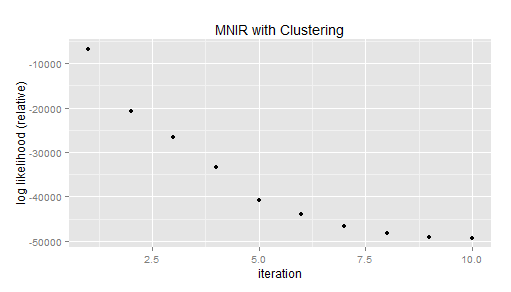

Correctly calculating log likelihood
----------

I used the corrected log likelihood formula we discussed last meeting:
(The book uses the following form:)

We want to maximize the above expression in terms of choosing cluster membership u_i

Issues: 

1. My current solution is computationally ineffecient, since, for the penalization term, I am not collapsing over V_i and cluster combinations. Better steps?
[Article on speeding up R](http://stackoverflow.com/questions/2908822/speed-up-the-loop-operation-in-r)

Results
---------
We see an decrease in negative log likelihood:

Cluster Initialization Results
------------

